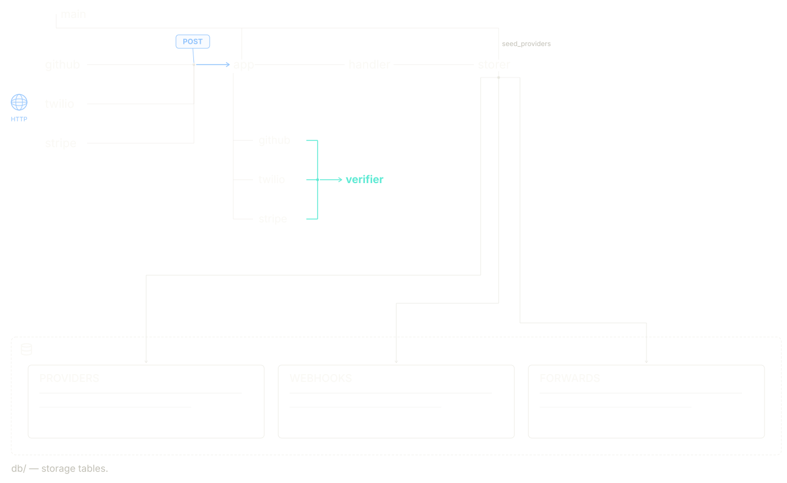

> A production level, lightweight, and rapid webhook normalization tool.

---

## What is it?

Adze is a centralized webhook normalizer and relay engine designed to securely ingest, verify, and standardize asynchronous events from multiple third-party providers like GitHub, Stripe, and Twilio. Adze strips away the structural inconsistencies of disparate webhook formats, packing them into a single, unified data envelope.

The service is built on a modern Python stack, operating as a lightweight Flask REST application. It is fully containerized with Docker and utilizes SQLAlchemy alongside PostgreSQL for reliable schema management and data handling. Operating as a secure, always-on middleman, Adze bridges the gap between external platforms and internal infrastructure, safely forwarding normalized event data downstream to stakeholders.

---

## Architecture

---

## Tech Stack
 
| Layer           | Technology                          |
|-----------------|-------------------------------------|
| Language        | Python 3.14+                        |
| API             | Flask 3.1+                          |
| Database Tools  | SQLAlchemy                          |
| Database Deploy | Postgres                            |
| Authentication  | hmac, hashlib                       |
| Testing         | pytest, mock, unittest              |
| Dev-Tools       | Docker, python-dotenv               |
